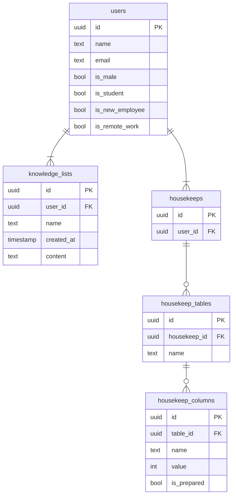

```mermaid
erDiagram

    users ||--|{ knowledge_lists: ""
    users ||--|{ housekeeps: ""
    housekeeps ||--o{ housekeep_tables: ""
    housekeep_tables ||--o{ housekeep_columns: ""

    users {
        uuid id PK
        text name
        text email
        bool is_male
        bool is_student
        bool is_new_employee
        bool is_remote_work
    }

    knowledge_lists {
        uuid id PK
        uuid user_id FK
        text name
        timestamp created_at
        text content
    }

    housekeeps {
        uuid id PK
        uuid user_id FK
    }

    housekeep_tables {
        uuid id PK
        uuid housekeep_id FK
        text name
    }

    housekeep_columns {
        uuid id PK
        uuid table_id FK
        text name
        int value
        bool is_prepared
    }

```